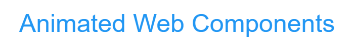
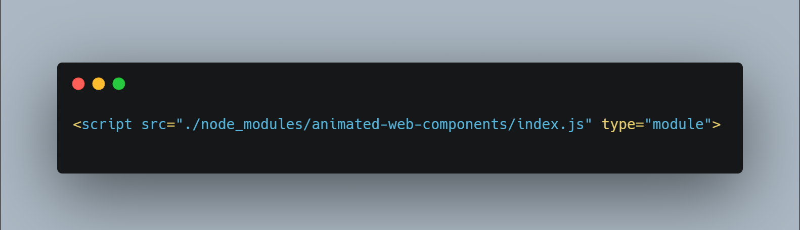
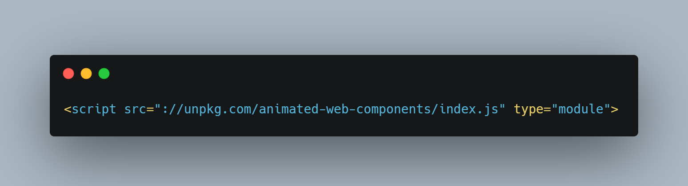
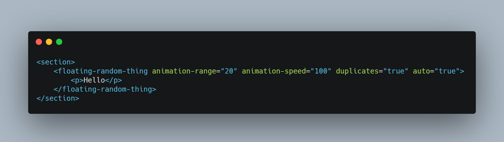
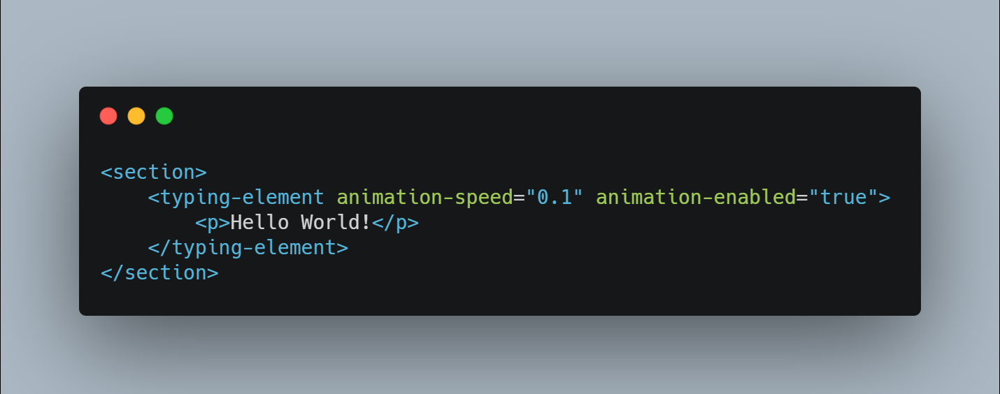
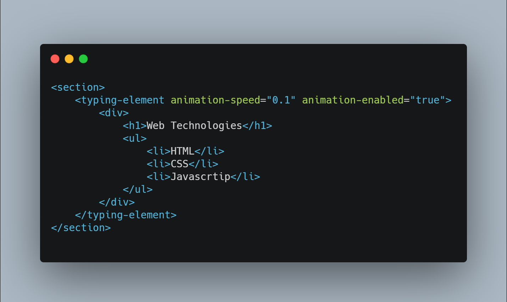

# Animated Web Components

Content on the web is increasingly _less static_. However adding even simple animations can be repetitive and verbose. This library uses Web Components to provide animations to objects inside a page. Still in development, more will be added soon.

## How To Use
To clone and run this, you'll need Git and Node.js (which comes with npm) installed on your computer. From your command line:


### Clone this repository
```bash
$ git clone https://github.com/edvilme/animated-web-components.git
```

### Go into the repository
```bash
$ cd animated-web-components
```

### Install dependencies
```bash
$ npm install animated-web-components
```


### Load NPM module in your HTML File
```html
<script src="./node_modules/animated-web-components/index.js" type="module">
```



### Using a Content Delivery Network (CDN)
If you prerfer, you can use [Unpkg.com](https://unpkg.com)
```html
<script src="://unpkg.com/animated-web-components/index.js" type="module">
```



> Important! The script is to be executed as a **module** regardless of the installation

## Usage

### Floating Random Thing
Use this tag to make its content float around its parent. Can be set to duplicate on click
```html
<section>
    <floating-random-thing animation-range="20" animation-speed="100" duplicates="true" auto="true">
        <p>Hello</p>
    </floating-random-thing>
</section>
```


### Typing element
Use this tag to make a text content appear as if it were being typed.
```html
<section>
    <typing-element animation-speed="0.1" animation-enabled="true">
        <p>Hello World!</p>
    </typing-element>
</section>

```


Rich HTML can also be used to display complex content:
```html
<section>
    <typing-element animation-speed="0.1" animation-enabled="true">
        <div>
            <h1>Web Technologies</h1>
            <ul>
                <li>HTML</li>
                <li>CSS</li>
                <li>Javascrtip</li>
            </ul>
        </div>
    </typing-element>
</section>
```




## Notes

> Important! Remember that all children must be wrapped in a **single** tag.

## How to Contribute
1. Clone repo and create a new branch: 
   ```bash
   $ git checkout https://github.com/edvilme/animated-web-components.git -b name_for_new_branch
   ```
2. Make changes and test
3. Submit Pull Request with comprehensive description of changes

## License

>    GPL-3.0

## Contributors

<!-- readme: contributors -start -->
<table>
<tr>
    <td align="center">
        <a href="https://github.com/edvilme">
            
            <br />
            <sub><b>Eduardo Villalpando Mello</b></sub>
        </a>
    </td>
    <td align="center">
        <a href="https://github.com/anthonyalvarez">
            
            <br />
            <sub><b>Anthony E. Alvarez</b></sub>
        </a>
    </td></tr>
</table>
<!-- readme: contributors -end -->
